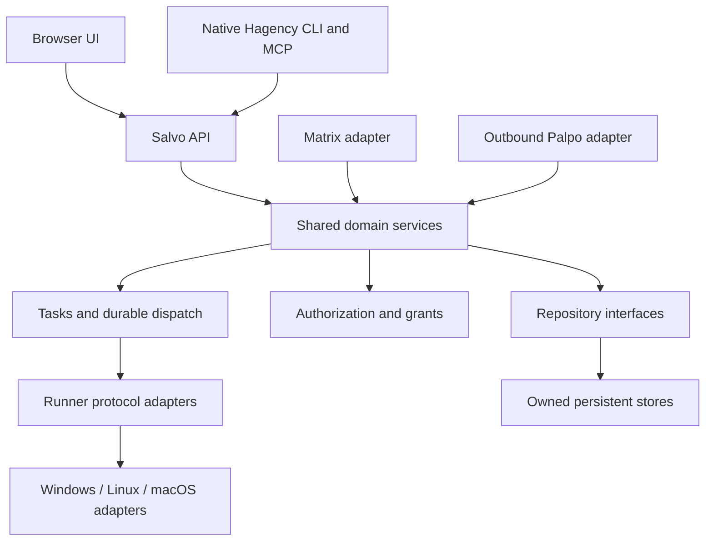
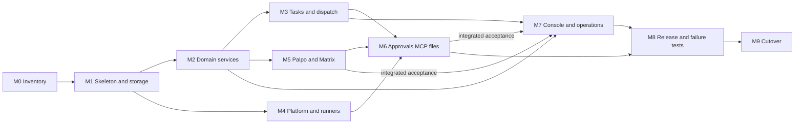

# Hagency Rust migration plan

Date: 2026-09-09. Status: implementation started in an isolated worktree; the native foundation is in verification. M0–M9 completion is not claimed.

Requirements: [REQ-RUST-MIGRATION-PLAN](../../knowledge/requirements/req-rust-migration-plan.md) and the subsequent [implementation authorization](../../knowledge/requirements/req-rust-migration-execution.md).

Current checkpoint: [native README](../../native/README.md). [ADR-095](../../knowledge/decisions/adr-095-native-state-ownership.md) resolves transaction ownership and adds latency, early proof and integration gates from the plan review. The implementation baseline is merged `5dbef22`; the inventory below records the earlier planning baseline.

## 1. Goal and decisions

Replace Hagency's deployed JavaScript/TypeScript processes with Rust, using
**Salvo** for HTTP and supporting **native Windows, Linux and macOS**. Implement
business rules once in a shared core. Isolate OS differences behind tested
adapters. Windows support must work without WSL, Bash or tmux as prerequisites.

The operator selected Rust, Salvo and all three operating systems. The module
layout, phase estimates, storage approach and release targets below are proposals
for delivering those requirements. This document authorizes no service changes.

The proposed deployment boundary is:

- Hagency services, CLI, MCP server, hooks and task helpers execute as native Rust
  programs. No Node.js interpreter or embedded JavaScript engine is shipped for
  Hagency's own runtime.
- Build the existing browser interface on a development/CI machine and serve its
  static assets from Rust. React JavaScript executes in the operator's browser.
  Keeping that browser interface is a proposed scope saving, not a claim that
  every source file in the product becomes Rust.
- Node may remain in development/CI for browser builds and existing regression
  tests. Development dependencies do not become device runtime dependencies.
- Agent executables, MCP extensions, Git and user projects are independent
  dependencies. A Rust Hagency does not make a Node-based Agent or JavaScript
  project run without Node. Publish a tested runner/platform capability matrix.
- Rust application code can use native dependencies, including SQLite. If
  “pure Rust” also forbids C libraries, that is an additional dependency/storage
  requirement to resolve before selecting crates.

Target embedded devices are Linux systems with an OS, networking and persistent
storage. Bare-metal microcontrollers, no_std, mobile apps and local model inference
are outside this migration. CPU/RAM limits are still unknown and require measurement.

## 2. Current source baseline

The read-only inventory used tracked files in the local Hagency checkout based on
`e927e46b316766ed56298159dfc9a2c67ed6ea54`. The working tree also contains concurrent
console cleanup. Do not include those edits in a migration implementation by
accident; establish a clean, pinned baseline at phase M0.

Approximate physical line counts include comments and exclude generated router
output, duplicate remote packages, dependencies and the separate website:

| Area | Lines | Interpretation |
| --- | ---: | --- |
| Root runtime files | 30,500 | Includes backend and Matrix bridge |
| Shared `lib/` modules | 26,200 | Domain rules, adapters and stores |
| `router/src/` | 9,000 | TypeScript execution and persistence layer |
| `src/` | 1,800 | Service/process and Matrix persistence helpers |
| Console and its tooling | 15,500 | Browser UI, Next server boundary and browser checks |
| Tests | 79,800 | Existing behavioral evidence; not all tests can execute unchanged |

The backend alone is approximately 17,700 lines; the Matrix bridge is approximately
11,300. There is no tracked Rust source or Cargo workspace in Hagency itself at
this baseline. Rust used internally by a dependency is not an existing Hagency core.

The migration unit is an owned behavior and its tests, not a JavaScript file.
Large files mix many responsibilities, and direct line-by-line translation would
preserve those dependencies without establishing clear authority.

## 3. Module ownership and disposition

“Port” means preserve externally observable behavior, including error paths.
“Adapt” means retain the behavior through a platform or protocol boundary.
Optional features remain on the parity inventory even when deferred from the
first release; no feature disappears merely because its source is inconvenient.

| Behavior | Current source owners | Rust destination / disposition |
| --- | --- | --- |
| HTTP API, validation, error responses, operator authentication, projections, event streaming | [backend](../../backend-v2.js), [backend adapters](../../lib/backend), [console proxy](../../mockup/app/api/hagency/[...path]/route.js) | `hagency-api`: Salvo handlers calling domain services; preserve separate operator/Agent/bridge/client authorities |
| Agent identity, home creation, framework/model configuration, launch eligibility | [home layout](../../lib/agent-home-v1.js), [launch policy](../../lib/agent-launch-policy.js), [readiness](../../lib/agent-launch-readiness.js), [framework definitions](../../lib/frameworks) | `hagency-core` plus runtime/platform adapters; preserve logical identity separately from display names and filesystem paths |
| Resource pools, roles, offers, capability qualification, shared-account quotas | [allocation budgets](../../lib/resource-allocation-budget.js), [seats](../../lib/seat-store.js), [resource definitions](../../lib/resource-agent-definitions.js), [role configuration](../../lib/role-capacity.json) | `hagency-core`: deterministic resource and eligibility rules |
| Requests, reservations, approval/rejection, selected-pool funding, release of capacity | [engagements](../../lib/engagement-store.js), [project Agent definitions](../../lib/project-agent-definition.js) | `hagency-core` + transactional repositories; preserve content-bound retries and prevent double reservation |
| Project servers, credentials, representatives, project ownership and access | [project-side store](../../lib/project-side-store.js), [provenance](../../lib/side-provenance.js), [representative](../../lib/matrix-representative.js) | Core owns decisions; Matrix/Palpo adapters supply authenticated observations |
| Durable tasks, heartbeat, blocked/resume/done, task graphs and delegation dependencies | [task store](../../lib/task-store.js), [task graphs](../../lib/task-graph.js), [task operations](../../router/src/task-operations.ts), [task repository](../../router/src/task-repository.ts) | `hagency-tasks`: one authoritative task state machine and repository |
| Dispatch claims, leases, cancellation, output settlement, restart recovery | [router store](../../router/src/store.ts), [router API](../../router/src/index.ts), [dispatch leases](../../src/dispatch-lease-store.mjs) | `hagency-tasks` + runtime adapter; preserve unknown outcomes, fencing and durable acknowledgments |
| Internal DMs/groups, mailboxes, delivery receipts, cursors, notification queues and reminders | [backend](../../backend-v2.js), [notification router](../../lib/notification-router.js), [delivery queue](../../lib/delivery-queue.js), [push relay](../../lib/push-relay-core.js) | Shared messaging service with durable delivery; terminal injection becomes an optional adapter |
| Palpo resource publication, heartbeats, request intake, results, generations | [outbound client](../../lib/fleet-outbound-client.js), [transport store](../../lib/fleet-outbound-store.js), [fleet protocol](../../lib/fleet-protocol.js) | `hagency-palpo`: outbound-only default with an independently owned transport inbox/outbox |
| Matrix sync, AS transactions, registration-token mode, room invitations, identities, bot commands | [Matrix bridge](../../bridge-matrix.js), [appservice modules](../../lib/appservice-sync.js), [representative sync](../../lib/representative-sync.js), [commands](../../lib/bot-commands.js) | `hagency-matrix`: Rust SDK/protocol adapters plus existing Hagency admission rules |
| Room/thread context, mentions, DM continuation, multi-Agent conversations, promotion privacy | [conversation store](../../router/src/conversations.ts), [direct chat](../../lib/matrix-direct-chat.js), [admission](../../lib/matrix-direct-admission.js), [reply hints](../../lib/reply-hint.js) | Shared conversation rules and durable cursors; Matrix provides verified event/device context |
| Owner approvals, YOLO, task-scoped and persistent grants, expiry and revocation | [approval store](../../lib/approval-store.js), [authorization](../../lib/execution-authorization.js), [Codex hook](../../lib/codex-permission-hook.js), [approval client](../../lib/runtime-approval-client.js) | `hagency-permissions`: one policy engine with per-runtime request/response adapters |
| Scoped Robrix Agent Operations access, signed requests, replay protection and enrollment | [Agent Operations](../../router/src/agent-ops.ts), [client authentication](../../lib/agent-ops-client-auth.js) | Separate client-auth service; never substitute operator credentials for scoped access |
| Runner protocols, streamed activity, process ownership, session reuse, Git worktrees | [runner](../../router/src/runner.ts), [guardian](../../router/src/runner-guardian.ts), [process ownership](../../router/src/owned-process-tree.ts), [worktrees](../../router/src/worktree.ts), [ACP](../../lib/runtime/acp.js), [tmux](../../lib/runtime/tmux.js) | `hagency-runtime` and `hagency-platform`; headless protocols first, terminal parity separately gated |
| MCP coordination, task maintenance, send/receive file tools, progress hooks | [MCP entry](../../mcp-server.js), [MCP core](../../lib/mcp-server-core.js), [progress filtering](../../lib/progress-filter.js), [progress CLI](../../bin/hagency-progress) | Native subcommands and bounded structured protocol IO; no hidden Node helper |
| Files, encrypted media, workspace containment, Markdown formatting, reliable replies | [Matrix files](../../lib/matrix-file.js), [file sessions](../../lib/session-file.js), [router files](../../router/src/files.ts), [Markdown](../../lib/matrix-markdown.js), [delivery journal](../../lib/matrix-delivery-journal.js) | Shared media policy and outbox with platform-safe file opening; preserve formatting and reply relations |
| Usage attribution, ledger, cache-read distinction, activity and health | [metering](../../lib/metering), [pane activity](../../lib/pane-activity.js), [runner activity](../../router/src/runner-activity.ts), [health](../../lib/backend/flow-health.js) | Shared parsers/calculations; per-runtime and per-platform discovery paths |
| Supervision, alerts, project inspection/board, Agent docs and memory-export restrictions | [supervision](../../lib/supervisor-action-engine.js), [alerts](../../lib/alert-store.js), [project inspection](../../lib/project-inspector.js), [project docs](../../lib/agent-project-docs.js), [export policy](../../lib/memory-export-policy.js) | Port when feature is included; retain restricted authority and explicit unavailable states |
| CLI, installation, startup, upgrades, diagnostics and remote package | [commands](../../bin), [services](../../services), [process helpers](../../src), [remote](../../remote) | Native CLI/package with OS service adapters; remote Agent role reuses Rust modules rather than a duplicated JS package |
| Browser UI and public website | [console](../../mockup), separate website repository | Retain browser components; move deployed Next server behavior into Salvo. Public website requires no runtime port |
| Unit/integration/browser tests, schemas and accepted specs | [tests](../../tests), [schemas](../../schemas), [specs](../../specs), [knowledge](../../knowledge) | Retain behavior vectors and browser checks; replace implementation-specific JS tests with Rust tests linked to the same requirements |

The CLI audit must also inspect shell scripts calling `node`, `python3`, `curl`,
`ps`, `chmod`, `tmux` or Unix shells. Removing `backend-v2.js` alone leaves Node
dependencies in Agent startup, task maintenance, MCP and approval/progress hooks.

## 4. Proposed Rust boundaries

The following names describe future Cargo packages/modules; they do not exist yet.
Start with fewer crates if that makes implementation easier, but keep ownership
and dependency direction explicit.

- **Domain core:** no Salvo request objects, Matrix SDK internals, shell commands
  or OS-specific paths in allocation/task/approval rules. Use typed inputs,
  explicit clocks/IDs and injectable external effects.
- **API:** Salvo adapts HTTP to authenticated commands and projected queries.
  Keep current credential boundaries; an in-process call is not an authority bypass.
- **Tasks/runtime:** the task store owns transitions; a runtime reports observations.
  Process exit, model final text and Matrix delivery are separate events.
- **Matrix/Palpo:** adapters perform IO, then submit authenticated observations.
  Transport receipt, admission, approval, execution and delivery stay distinct.
- **Storage:** keep a single owner for task truth. A transport inbox/outbox does
  not become a second task database. SDK crypto storage has its own exclusive owner.
- **Platform:** provide process ownership, terminal IO, secure file operations,
  service installation, runtime directories and executable discovery.

Proposed packaging is one native executable with subcommands such as `serve`,
`mcp`, `task`, `hook` and `service`. It may run in multiple processes, including a
small guardian. One executable does not require one process or one failure domain.
CLI, MCP and hook processes use authenticated local service interfaces; they do
not open another writable copy of core/task state. Only the assigned service owns
that state, while a transport process may own its separate inbox/outbox or crypto store.
Pin crate versions and supported features during M0/M1; do not promise a completely
static binary before auditing SDK, SQLite, TLS and runner dependencies.

## 5. Native platform plan

Proposed first release architecture matrix: Windows x86_64, Linux x86_64/aarch64,
and macOS x86_64/aarch64. Exact OS versions and Windows ARM64 are open until the
runner/SDK/dependency checks. Native Windows must be tested on Windows, not inferred
from a successful Linux cross-compilation.

| Boundary | Linux | macOS | Windows | Required evidence |
| --- | --- | --- | --- | --- |
| Start/stop/own processes | Process groups and verified descendant identity; evaluate pidfds/cgroups where applicable | Process groups and verified descendant identity with macOS APIs | Job Objects, process handles and startup ownership established before work begins | Parent crash, grandchild spawn, PID reuse, cancellation and failed spawn cannot leave untracked work or kill unrelated processes |
| Interactive terminal | Unix PTY; optional tmux adapter | Unix PTY; optional tmux adapter | ConPTY through a native adapter | UTF-8, resize, EOF, output backpressure and disconnect/reconnect; daemon owns persistent sessions |
| Service installation | systemd where available; documented foreground/init alternative for embedded Linux | launchd | Windows Service Control Manager | Install/start/stop/uninstall, boot recovery and account permissions |
| Commands | Explicit executable/argv; shell only for intentional shell tasks | Same, with native executable discovery | Explicit executable/argv and `.exe`/`.cmd` handling; PowerShell/cmd only when required | Spaces, Unicode, quotes, environment isolation and exit status behave correctly |
| Paths and worktrees | Native paths, mount boundaries and case-sensitive fixtures | Native paths and case-sensitive/insensitive fixtures | Drive/UNC paths, reserved names, case behavior, long paths and reparse points | Logical IDs do not become unsafe filenames; workspace containment survives races |
| Private files | Owner-restricted modes, safe open/rename and file locks | Owner-restricted modes, safe open/rename and file locks | Explicit DACLs, handle-based checks and sharing/locking rules | Another local user cannot read Agent credentials; symlink/junction/hard-link escapes rejected |
| Runner sandbox | Verify the selected runner's Linux implementation | Verify its macOS implementation | Verify its native Windows implementation | Requested policy equals observed effective policy, or launch is refused with a reason |
| Upgrade | Replace binary after drain and health checks | Same, with packaging/signing requirements | Handle running executable locks and service restart safely | Rollback uses a compatible state snapshot; no silent loss of completed external effects |

The current [guardian](../../router/src/runner-guardian.ts) explicitly rejects
`win32` and launches `/bin/sh` plus `/bin/ps`. Rewrite that boundary rather than
renaming imports. Job Objects provide process-group management on Windows; they
are **not** a complete filesystem/network sandbox. A PTY also does not supply
tmux's session persistence, pane model or restart semantics; those need an explicit
terminal manager if retained.

Do not claim every Agent framework works on every OS merely because Hagency
starts there. For each supported runner/version/platform combination, record
protocol availability, model configuration, authentication, approvals, sandbox,
progress, resume and cleanup results. Unsupported combinations must be unavailable
in the resource catalog with a reason.

## 6. Required behavioral invariants

These remain mandatory throughout the port and take precedence over simplifying
an adapter. Existing accepted artifacts, including their later amendments, are
the behavior baseline:

1. **Provider workflow:** configure resource → publish → project defines/requests
   Agent → provider approves → provision/assign → monitor → revoke. Do not require
   a second manual Agent-creation step in the provider UI. Preserve selected-pool
   budgets and shared-account limits. See [ADR-022](../../knowledge/decisions/adr-022-resource-first-agent-allocation.md).
2. **Outbound transport:** Hagency initiates connections. ACK means durable receipt,
   never approval or fulfillment. Preserve request IDs, content digests, leases,
   generations and result retries. See [REQ-PALPO-OUTBOUND](../../knowledge/requirements/req-palpo-outbound.md).
3. **Authority:** complete authenticated Matrix IDs, exact room/device identity,
   current owner bindings and current capability generations. Missing or ambiguous
   authority fails closed; display names never grant access.
4. **Approvals:** owner-private decisions only; ordinary text cannot approve an
   operation. YOLO is contributor-controlled. Preserve once/task/persistent scopes,
   expiry and revocation. Unknown scopes cannot become reusable grants. See
   [execution authorization](../../knowledge/requirements/req-execution-authorization.md).
5. **Conversations:** group mentions trigger work; unmentioned discussion and Agent
   output are context. A valid one-to-one DM continues without mentions. Promotion
   to a group creates a privacy boundary, including delayed replies with no thread
   root. Preserve bounded history and per-Agent successful positions. See
   [ADR-023, including September 9 updates](../../knowledge/decisions/adr-023-room-conversation-context-and-direct-chat.md).
6. **Task completion:** only an authorized canonical task transition marks done.
   Runner completion and a success-looking final message do not. Preserve scoped
   delegation and independent verification of inner work. See
   [three-layer completion](../../knowledge/requirements/req-three-layer-task-completion.md).
7. **Files:** exact dispatch scope, bounded bytes, verified integrity, safe workspace
   containment, durable snapshots and acknowledged delivery. Encrypt uploads for
   encrypted destinations; history backfill does not download all attachments.
   See [ADR-027](../../knowledge/decisions/adr-027-session-file-delivery.md).
8. **Client control:** Robrix's scoped Agent Operations client never receives the
   backend operator token. Preserve proof-of-possession, canonical signing inputs,
   replay protection and authorization fences. See
   [client access requirement](../../knowledge/requirements/req-agent-ops-client-access.md).
9. **Recovery:** timeout or process loss may produce `outcome_unknown`; it is not
   permission to rerun a possibly completed external mutation. Cancellation and
   cleanup must be observed, not inferred from a parent process exit alone.
10. **Revocation:** release reservations correctly; preserve other active uses of
    an Agent. Final retirement must apply the existing Matrix access/account/room
    cleanup policy and report pending or failed cleanup honestly.
11. **Usage:** unknown remains unknown. Fresh tokens, cache reads, committed
    allocations and actual usage are distinct. Do not introduce monetary billing
    or claim a declared ceiling is automatically enforced at runtime.

## 7. Detailed implementation flow

Every phase creates a bounded implementation task contract and binds actual tests
before source edits. This document is the planning artifact, not a claim that
those future task contracts or tests already exist.

### M0 — Freeze the behavior and platform scope (1–2 engineer-weeks)

1. Use an isolated worktree based on a recorded, clean source revision. Preserve
   concurrent changes and all live deployments.
2. Inventory endpoints, CLI commands, MCP tools, events, schemas, stores, framework
   adapters and feature flags. Record each as port / replace / retain / defer.
3. Map accepted requirements and current tests to those behaviors. Reconcile
   earlier ADR text with later corrections; document remaining contradictions.
4. Choose initial CPU/OS/runner versions and the embedded-device resource budget.
5. Capture sanitized protocol/state fixtures and deterministic test vectors. Pin
   timestamps, generated IDs and secrets in fixtures only.
6. Create a future Rust project contract. Explicitly revise the current project's
   Node/Vitest-only implementation assumptions when Rust code is introduced;
   preserve the security clauses and requirement IDs.

**Exit gate:** every deployed entrypoint has an owner/disposition; all features
promised for release have a requirement, target platform and validation plan.

### M1 — Native skeleton, contracts and persistence (3–5 engineer-weeks)

Implementation uses the ownership/commit table and bounded work gates in ADR-095.
Run encrypted SDK persistence and native Windows ownership/runner proofs early;
full Matrix/runner integration remains in M4/M5. Hardware workload budgets remain
release gates until measured on the selected targets.

1. Create the Cargo workspace, Salvo application, native CLI, structured logging,
   config validation and platform interfaces. Add CI jobs on all three OS families.
2. Define typed logical IDs, validated protocol DTOs, error codes and UTC time
   serialization. Separate wire identity from paths and display names.
3. Establish repositories for core state, router state, outbound transport and
   private credentials. Start with SQLite where it reduces behavioral change;
   reuse checked schema definitions, not JavaScript database wrappers.
4. Implement transactional updates, schema version checks, exclusive ownership,
   atomic private-file replacement and bounded storage cleanup.
5. Add exact vectors for signed/canonical JSON, integer ranges, Unicode, missing
   versus null fields, byte digests and timestamps. Rust serialization alone does
   not guarantee JavaScript wire/signature equivalence.

**Exit gate:** native binaries start on all declared targets; corrupt/unsupported
state fails explicitly; restart retains committed records; no Node process is
needed for the skeleton. Signature vectors match the pinned protocol.

### M2 — Resource and project domain services (4–6 engineer-weeks)

1. Port Agent/preset/model/role qualification, shared accounts and resource budgets.
2. Port project connections and owner metadata without making display labels authority.
3. Port request intake, reservations, approve/reject and capacity release.
4. Expose Salvo APIs with the current authentication distinctions and truthful DTOs.
5. Reuse pure test cases as language-independent vectors. Compare old/new decisions
   in isolated fixtures; document intentional corrections separately.

**Exit gate:** replayed requests cannot reserve twice; simultaneous requests cannot
oversubscribe a pool; unavailable authority or quota data follows the accepted
failure policy. Approval selects the requested eligible resource correctly.

### M3 — Messaging, tasks, delegation and durable dispatch (5–8 engineer-weeks)

1. Port internal mailbox/group delivery, cursors, ordering, deduplication and receipts.
2. Port task state transitions, heartbeat, wait/resume, graph dependencies and
   delegation scope. Keep one canonical task store.
3. Port dispatch leases, fencing generations, frozen inputs, replies/outbox and
   explicit unknown outcomes. Attach provenance to work before external effects.
4. Make Agent/session/task capabilities available through a narrow service API;
   runtime adapters must not write repositories directly.
5. Inject a crash at each transaction boundary and confirm recovery behavior.

**Exit gate:** duplicate inputs and competing claims do not run duplicate work;
stale sessions cannot change tasks; an inner result does not complete its parent
task; uncertain outcomes remain inspectable without automatic unsafe replay.

### M4 — Runners and native process ownership (7–12 engineer-weeks)

1. Implement shared structured runner interfaces for start, input, activity,
   permission requests, completion, cancellation and cleanup observation.
2. Port one supported headless protocol first. Add the other currently supported
   framework adapters against the same contract, including ACP where applicable.
3. Implement Linux/macOS process ownership and Windows Job Object ownership.
   Establish ownership before the child can spawn work; test breakaway/cleanup limits.
4. Replace hard-coded shell startup, environment inheritance, workspace helpers
   and Node guardians with native entrypoints. Preserve per-Agent credentials.
5. Port Git worktree leases, dirty-state inspection, session reuse and resume metadata.
6. Add terminal adapters and session persistence if terminal mode is in the release.
   Headless success is not terminal-mode parity.

**Exit gate:** test binaries exercise nested children, spawn failure, parent death,
PID reuse, Unicode paths and cancellation on real OS runners. No unrelated process
is signaled. Sandbox and approval capabilities are verified for each real runner
combination before it is advertised as available.

### M5 — Palpo and Matrix communication (6–10 engineer-weeks)

1. Port resource publication, heartbeats, leased intake and result delivery using
   the current Palpo wire contract. Keep token rotation/generation semantics.
2. Port AS transaction collection and registration-token client sync as separate
   adapters. A Palpo-side receiver remains on the project side for outbound mode.
3. Port room admission, representatives, identities, invitations and operator commands.
4. Integrate Matrix Rust SDK devices, encryption and persistent crypto ownership.
   Implement exact authenticated-event provenance before accepting owner verdicts.
5. Port threads, mentions, background discussion, continued DMs, multi-Agent rooms
   and private-to-group promotion boundaries.

**Exit gate:** controlled Matrix/Palpo fixtures prove offline intake, reconnect,
generation rotation, duplicate transactions and admission failures. Dedicated
integration accounts prove encrypted DMs, membership and device behavior; no
plaintext fallback or shared live crypto store is allowed.

### M6 — Approvals, MCP, hooks and attachments (6–10 engineer-weeks)

1. Port approval identity, scope matching, expiry, once/task/persistent decisions,
   grant rotation and revocation. Keep project input unable to enable YOLO.
2. Implement runtime-specific adapters with explicit deny/failure results when
   a required channel is absent. Verify installed helper identity and configuration.
3. Port the MCP server, task-writer behavior and progress hook to native commands.
   Preserve caller-bound task/conversation access and non-recursive coordination rules.
4. Port text formatting, file receive/send, encrypted media, staging snapshots,
   download bounds, safe file handles and durable delivery receipts.
5. Port scoped Agent Operations bootstrap, enrollment, signed commands and replay fences.

**Exit gate:** wrong-owner/public-room/expired/stale-generation approvals fail;
saved grants survive restart and stop authorizing after revocation. Encrypted file
round trips pass on all target OS families. Delayed text, activity or files cannot
escape an earlier private session after room promotion.

### M7 — Console, usage and operations (4–7 engineer-weeks)

1. Replace Next server API/proxy behavior with Salvo handlers. Preserve server-side
   credentials and endpoint allowlists; do not put the operator token in browser assets.
2. Serve a browser app with live runtime routing. The existing static export only
   pre-generates fixture Agent names; it is insufficient for newly provisioned Agents.
3. Port metering parsers, discovery paths, ledger, health checks, alerts and progress
   throttling/redaction. Recheck incomplete coverage and cache-token semantics.
4. Port included supervisor, project-board/inspection and maintenance capabilities.
   Keep non-authoritative observations separate from task truth.
5. Replace deployed CLI/script dependencies and prepare the Rust remote Agent role.

**Exit gate:** existing product workflows pass browser tests against Rust in both
languages. Unknown values and failed operations remain visible. A minimal installed
environment without Node/Python/Bash can run all claimed native Hagency workflows,
apart from explicitly declared external runner/tool dependencies.

### M8 — Cross-platform release and failure testing (5–9 engineer-weeks)

1. Produce per-target packages, service integration, fresh-install diagnostics and
   uninstall procedures. Define signing/notarization policy where applicable.
2. Run native unit, contract, integration, process and filesystem suites on Windows,
   Linux and macOS. Cross-compilation is only a build check.
3. Run end-to-end resource request, approval, delegation, files, usage and revocation
   on dedicated fixtures/accounts. Test two Agents sharing a room and separate DMs.
4. Exercise network outage, lease expiry, partial upload, server rejection, process
   death, disk-full and recovery. Storage fault injection must not claim physical
   power-loss durability without the required filesystem/flush testing.
5. Measure RSS, CPU, startup, idle polling, encrypted history, DB growth and file
   buffering on the actual embedded Linux hardware. Set release budgets from evidence.
6. Scan packaged entrypoints and generated hooks for residual `node` dependencies.

**Exit gate:** every required platform/runner cell passes its declared checks.
Skipped, uncertain or untested cells are not advertised as supported.

### M9 — Controlled cutover and retirement (2–4 engineer-weeks)

Follow the state transition procedure below, verify the selected production
workflow, and remove the JS deployment only after the Rust release has passed
the required acceptance gates. No unattended dual-writer phase is proposed.

**Exit gate:** one active authority owns each deployment, Matrix device, queue and
database; operators can inspect recovery state and follow a tested rollback or
forward-repair procedure.

### Phase dependencies

M4 and M5 can progress against frozen interfaces while task work proceeds.
M6 integration requires their contracts to agree. Platform CI and failure tests
begin in M1 and expand in every phase; M8 is the release gate, not the first test run.

## 8. Test strategy and traceability

Use three layers of evidence:

1. **Deterministic core tests:** Rust unit/property tests for budgets, state
   transitions, generations, scope matching, canonical bytes and replay behavior.
2. **Protocol and OS integration:** scripted fake runners and Matrix/Palpo fixtures,
   real native processes and filesystems, controlled clocks and injected failures.
3. **Product acceptance:** browser workflows and dedicated external-system tests,
   with observed Matrix delivery and actual runner execution where claimed.

Existing Vitest and Playwright tests can remain CI tools. Tests that call HTTP
can be adapted to the Rust process. Tests importing JS internals need a Rust
equivalent; retaining an old JS test alone does not validate its Rust replacement.
Preserve selectors or maintain an explicit old-selector → Rust-test mapping so
accepted scenarios do not silently lose coverage.

For each requirement record: source owner, Rust owner, test selector, test level,
platforms, fixture type, last evidence and unresolved gaps. Agent-spec lifecycle
can bind Rust/Cargo tests when implemented. Any Node-only scenario skipped by the
installed lifecycle remains non-passing and needs its separate real test evidence.

Parity comparisons use isolated stores and fake external effects. Do not run the
old and new bridge against the same Matrix device, sync cursor, approval queue or
Palpo lease. Shadow mode means offline replay or a strictly read-only, independently
credentialed observer; it never means two production execution authorities.

## 9. State transition, cutover and rollback

### Development and fresh installation

Use fresh isolated Rust state by default. No old-brand aliases or permanent JS
compatibility runtime are required. Preserve the current Hagency/Palpo/Robrix wire
contracts unless an explicitly versioned protocol change is adopted. Supporting
current peer protocols is separate from preserving obsolete product names.

If continuity of the existing local deployment is required, implement a deliberate
one-time importer. This is a proposed option, not authorization to copy live stores.
Inventory JSON stores, router SQLite, outbound SQLite, private credentials, crypto
stores, media staging, Agent homes and resume metadata separately. Validate logical
IDs, relation counts, outstanding work and schema versions on sanitized snapshots.

Existing Matrix SDK crypto storage must be investigated before committing to an
import path. Do not assume the Node binding and Rust client share an interchangeable
store format. A fresh device may require verification and historical-key recovery;
it must not silently replace the existing identity or lose decryption capability.

### Deployment sequence

1. Complete offline parity tests and produce a versioned release plus rollback kit.
2. Record deployment identity, expected versions and the selected state strategy.
3. Stop accepting new execution work and drain active runners, approvals and outboxes.
   Record unresolved work explicitly; do not mark it done to simplify shutdown.
4. Quiesce JS writers and take consistent backups of all related stores. Use a
   safe SQLite backup/checkpoint procedure and preserve required journal/WAL data.
5. Fence old queue consumers and obtain exclusive store/device ownership. If
   transport generations rotate, coordinate both endpoints and reject stale work.
6. Initialize fresh Rust state or import the quiesced snapshot. Validate integrity,
   identities, reservation totals, pending outcomes and media references before IO.
7. Start Rust, verify local API/authentication, then outbound transport and authenticated
   Matrix delivery. Keep execution paused until owner and runner readiness are proven.
8. Run a bounded approved task, follow-up, private approval, file transfer and revoke
   check in a dedicated validation scope. Reconcile delivery and resource release.
9. Resume intake, observe reconnect/restart behavior, then retire JS services after
   the acceptance window. Keep recovery artifacts private with documented retention.

### Rollback limits

- Before Rust creates external effects or changes live state, rollback can restore
  the quiesced snapshot and original service configuration after stopping Rust.
- After Rust accepts requests, sends messages, rotates credentials or executes work,
  restoring an older DB alone may duplicate work or undo authorization fences. Drain
  and reconcile effects, then use a proven compatible state export or forward repair.
- Crypto stores, remote generation state and already-sent events cannot be treated
  as ordinary application files that can safely be rewound independently.
- Never start the old runtime on an unknown newer schema or reuse a revoked credential
  to make rollback appear successful. Preserve explicit unknown/pending states.

## 10. Delivery slices and workload

Estimates assume engineers experienced with Rust, Matrix and process supervision,
AI-assisted implementation, access to the existing tests, and stable scope. They
are sizing ranges, not delivery commitments or a percentage measured from line count.

| Delivery | Included | Excluded until later | Estimated total effort |
| --- | --- | --- | ---: |
| Native foundation | Salvo, CLI, storage, platform interfaces and fake-runner smoke on all three OS families | Production Matrix/Agent parity | 4–7 engineer-weeks |
| Focused first product | Resources → Palpo request → provider approval → one supported headless runtime per declared platform → task/result/basic usage, with the required owner-approval path | Full terminal behavior, all frameworks, historical state import, full multi-Agent/media parity | 20–30 engineer-weeks, provisional |
| Broad parity release | All retained rows in the inventory, three-OS validation, encrypted DM/thread/file rules, grants, recovery, operations and controlled cutover | New product features and unsupported hardware/runtime combinations | 43–73 engineer-weeks from M0–M9; budget approximately 45–75 |

These delivery estimates overlap; do not add them together. M0–M9 phase ranges
sum to 43–73 engineer-weeks. A two-engineer broad-parity program is plausibly
7–12 calendar months once integration dependencies, review and platform debugging
are included; a larger team does not remove the critical path. Re-estimate after
M0 and the Windows ownership/runner proof in M4.

The earlier discussion's 40–70 engineer-week broad estimate was preliminary.
The detailed inventory explicitly includes native Windows process/terminal work,
all deployed helper entrypoints and release validation, which widens the range.
Most domain code remains shared; supporting three OS families does not multiply
every feature by three. Confidence is medium for the architecture and low-to-medium
for schedule until hardware, runner versions and state continuity are settled.

## 11. Open choices and risk-reduction work

| Choice / risk | Resolve by | Required result |
| --- | --- | --- |
| Embedded CPU, RAM, storage and libc; exact desktop OS/CPU targets | M0 | Measurable target matrix and resource budgets |
| First supported Agent runtime/version on each platform | M0/M4 | Protocol, auth, sandbox and cleanup proof; unavailable combinations explicit |
| Browser JS allowed; Node only on build machines | M0 | Confirm deployment boundary; a Rust/no-JS browser rewrite is separate scope |
| SQLite/native dependencies allowed | M1 | Dependency/license/target audit and pinned feature set |
| Fresh install versus preserving the current local deployment | M0 | Chosen cutover profile; one-time importer only if needed |
| Crypto store/device continuity | M1/M5 | Proven compatible import or explicit new-device verification/key recovery plan |
| Terminal mode required in first release | M0/M4 | Persistent native terminal behavior or clearly limited first milestone |
| Canonical JSON/signature differences | M1 | Cross-language golden vectors, including Unicode and number limits |
| Windows descendants escaping ownership; POSIX reparenting/PID reuse | M4 | Adversarial native process tests; unsupported cleanup states fail closed |
| Crash after external mutation before local receipt | M3/M8 | Durable unknown-outcome inspection and content-bound retries |
| SDK/runner version drift | Every release | Pinned matrix and requalification before enabling changed versions |
| Optional historical features versus required parity | M0 | Explicit disposition per inventory row; no silent omission |

## 12. Definition of done

- Every retained behavior has a Rust owner and linked passing tests.
- Windows, Linux and macOS releases pass native process, filesystem and workflow
  checks for their declared runner/architecture combinations.
- Hagency's packaged runtime, generated MCP configuration and helper hooks do not
  invoke Node.js or hide an embedded JavaScript runtime.
- The browser UI works with real newly created Agent IDs through Salvo.
- Required Matrix privacy, owner-approval, file-delivery and revocation tests pass.
- Allocation and task truth survive retries/crashes without silent duplicate effects.
- Resource budgets are measured on the embedded device and published with limits.
- Fresh installation, upgrade, recovery and the selected state-continuity strategy
  have tested procedures. Unknown results and platform skips remain explicit.
- No shipped feature is described as supported solely because it compiles.

## 13. References and document validation

External primary references inspected during planning:

- [Salvo source and features](https://github.com/salvo-rs/salvo): shared HTTP layer,
  routing and middleware on Hyper/Tokio.
- [Matrix Rust SDK](https://github.com/matrix-org/matrix-rust-sdk): sync, room state
  and encryption building blocks; Hagency admission/policy remains application work.
- [Next.js static exports](https://nextjs.org/docs/app/guides/static-exports): static
  browser assets can be served without Next at runtime; dynamic server behavior
  still needs an implementation.
- [Windows Job Objects](https://learn.microsoft.com/en-us/windows/win32/procthread/job-objects):
  process grouping, termination, breakaway rules and limits.
- [Windows pseudoconsole sessions](https://learn.microsoft.com/en-us/windows/console/creating-a-pseudoconsole-session):
  native terminal hosting through ConPTY.

This artifact is a documentation deliverable. Validation checks its relative
links, phase coverage, required platform/Salvo decisions and separation of planned
versus implemented behavior. No Rust runtime, migration, benchmark, deployment or
runtime acceptance test is claimed complete by publishing this plan.

Document checks completed on 2026-09-09: 86 relative links resolved, all ten phase
headings and the 43–73 engineer-week sum checked, required platform/Salvo coverage
checked, code fences balanced, and `git diff --check` passed. Application code and
runtime services were not changed by this documentation task.
